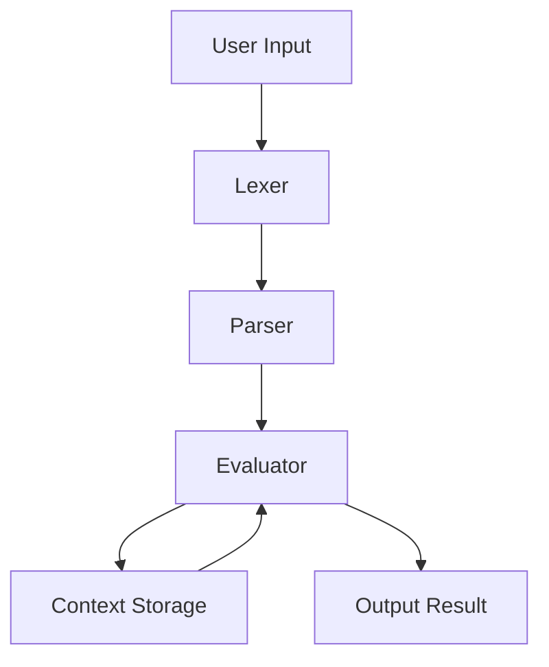

# Computor-v2: Mathematical Interpreter

## Project Overview

Computor-v2 is a powerful command-line mathematical interpreter designed to handle a wide variety of mathematical operations and types. It allows users to input expressions, equations, and assignments, and receive computed results interactively. The project serves as a foundation for advanced mathematical tools, providing essential features for solving equations, manipulating variables, and working with functions and matrices.

## Core Objectives

- **Mathematical Capabilities:** Supports real numbers, rational numbers, complex numbers, matrices, and polynomial equations (up to degree 2).
- **Type Handling:** Variables can be assigned, reassigned, and inferred based on mathematical expressions, with seamless transitions between types (rational, complex, matrix, etc.).
- **Expression and Equation Solving:** Resolves both simple and complex mathematical expressions, including solving polynomial equations of degree ≤ 2.
- **Functionality:** Allows defining and manipulating functions, supporting operations such as evaluation and function composition.
- **User Interface:** Provides an interactive shell for inputting mathematical expressions and retrieving results, while maintaining computation priorities and history.

## Architecture Overview

The project is organized into modular components, each responsible for a specific stage of processing:



- **Lexer:** Tokenizes user input into meaningful symbols (numbers, operators, variables, etc.).
- **Parser:** Converts tokens into an Abstract Syntax Tree (AST) representing the structure of the expression.
- **Evaluator:** Recursively evaluates the AST, performing computations, variable/function assignments, and matrix operations.
- **Context Storage:** Maintains state for variables and functions across user inputs.
- **Helpers:** Provides colored output and utility functions for improved user experience.

## Main Components

| File                | Purpose                                      |
|---------------------|----------------------------------------------|
| `computorv2.py`     | Main interpreter, shell, and processing loop |
| `lexer.py`          | Tokenizes user input                         |
| `parser.py`         | Builds AST from tokens                       |
| `evaluator.py`      | Evaluates AST, manages context               |
| `helpers.py`        | Colored output for shell                     |
| `test_*.py`         | Unit tests for features and error handling   |

## How to Use

### Requirements
- Python 3.x
- No external dependencies required

### Running the Interpreter

1. **Clone the repository:**
   ```sh
   git clone https://github.com/Alcheemiist/ComputorV2.git
   cd ComputorV2
   ```
2. **Run the interpreter:**
   ```sh
   python3 -m computor.computorv2
   ```

### Interactive Shell Commands
- Enter mathematical expressions, assignments, or function definitions directly:
  - `x = 2 + 3`
  - `y = 3/4`
  - `z = 2 + 3j`
  - `A = [[1,2];[3,4]]`
  - `f(x) = x ^ 2 + 2 * x + 1`
  - `f(3)`
- Special commands:
  - `!all` — Display all stored variables and functions
  - `history` — Show input/result history
  - `exit` or `q` — Quit the interpreter

### Example Session
```
clc(0)> x = 2 + 3
 | = 5
clc(1)> y = 3/4
 | = 0.75
clc(2)> z = 2 + 3j
 | = (2+3j)
clc(3)> A = [[1,2];[3,4]]
 | = [[1, 2], [3, 4]]
clc(4)> f(x) = x ^ 2 + 2 * x + 1
 | = x ^ 2 + 2 * x + 1
clc(5)> f(3)
 | = 16
clc(6)> !all
 | <---  Variables and functions stored  --->
 |> x = 5
 |> y = 0.75
 |> z = (2+3j)
 |> A = [[1, 2], [3, 4]]
 |> f = x ^ 2 + 2 * x + 1
 | <---------------------------------------->
```

## Bonus Features (Planned/Optional)
- Advanced function curve displays
- Additional mathematical functions (e.g., exponential, trigonometry)
- Matrix inversion and vector computations
- Function composition and command history tracking

## Contributing
Contributions are welcome! Please open issues or submit pull requests for improvements, bug fixes, or new features.

## License
This project is open-source and available under the MIT License.

